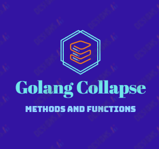

# Golang Collapse

Con esta extensión podra colapsar todos los métodos y funciones en el archivo que está trabajando con solo activar un comando.

## Características

- Colapsa automáticamente todos los métodos y funciones en archivos de Go.
- Funciona tanto para métodos de una sola línea como para métodos de varias líneas de parámetros.
- El cursor se posiciona en la primera línea después de colapsar los métodos.

## Requisitos

- Visual Studio Code versión 1.0.0 o superior.

## Instalación

1. Abre Visual Studio Code.
2. Ve a la sección de extensiones.
3. Busca "Golang Collapse".
4. Haz clic en "Instalar".
5. Reinicia Visual Studio Code.

## Uso

1. Abre un archivo de Go en Visual Studio Code.
2. Utilizael comando Ctrl+Shift+P y busca el comando "Collapse all methods" en el menú.
3. Todos los métodos en el archivo se colapsarán automáticamente.
4. El cursor se posicionará en la primera línea después de los métodos colapsados.

## Comandos

- `extension.collapseAllFuncs`: Colapsa todos los métodos en el archivo de Go actual.

## Créditos

- Gracias a chay GPT y Github Copilot sin vosotros no hubiera podido hacerlo.
